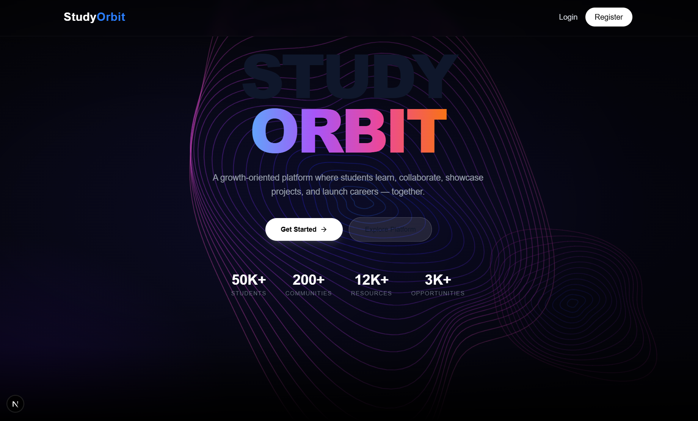
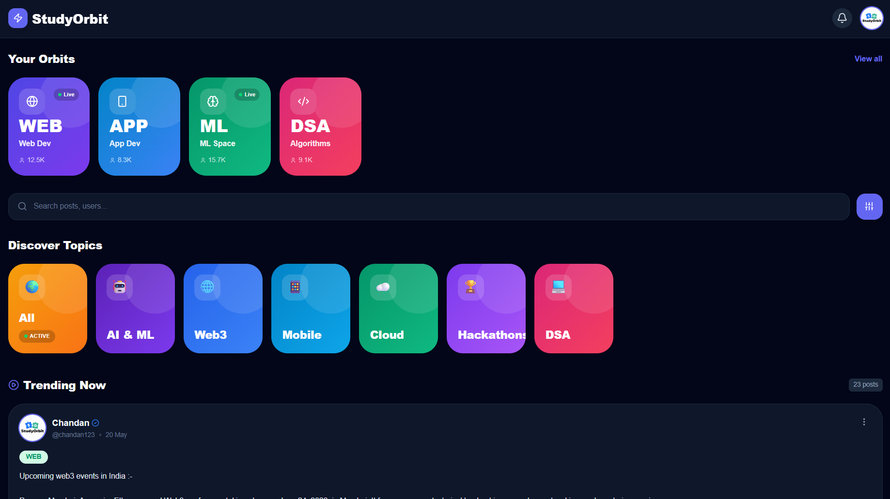
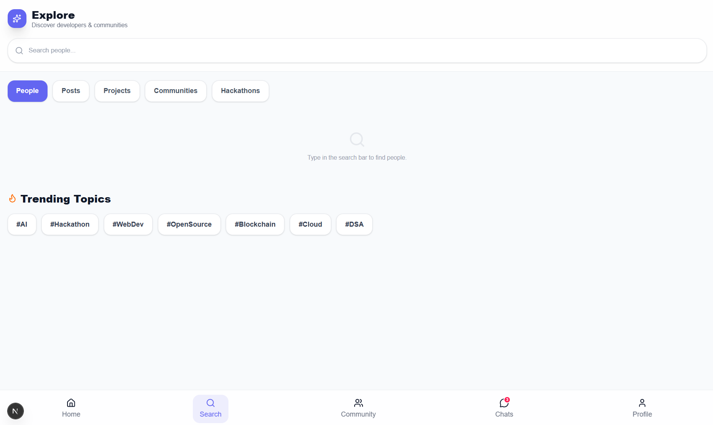
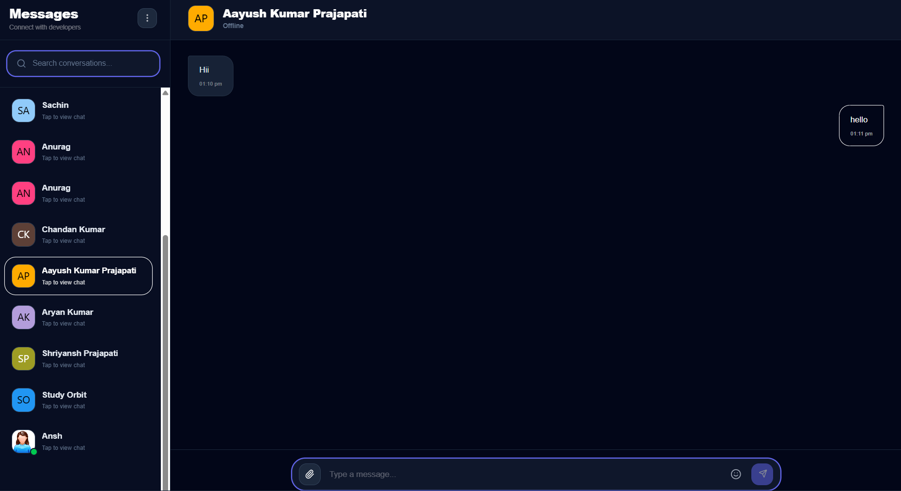
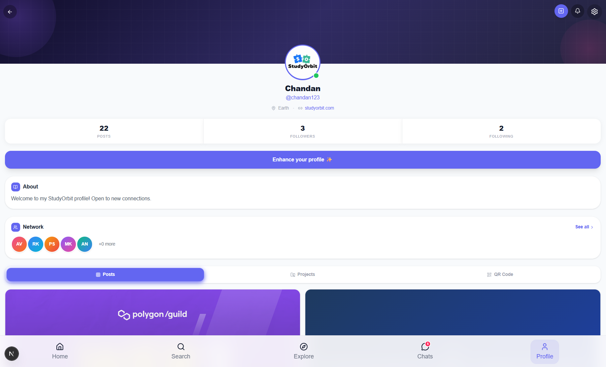
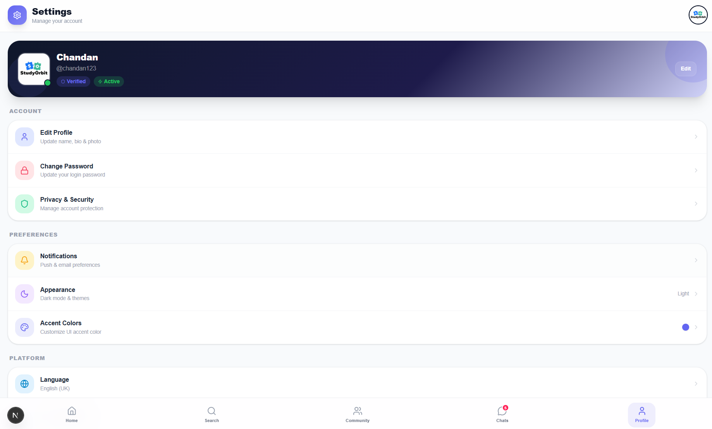

# StudyOrbit 🚀


A modern, full-stack collaborative platform designed for students and developers. StudyOrbit empowers users to connect, collaborate, and grow through real-time communication, dynamic communities, and a highly customizable user interface.


## 📸 App Previews

<div align="center">
  
  
  
  <br> <br> 
  
  
  

  <br> <br>
  
  
  
</div>

## ✨ Key Features

* **Real-Time Communication:** Instant 1-on-1 and community messaging powered by Socket.io.
* **Connected Devices (Session Management):** Track active login sessions across different devices and remotely revoke access for enhanced security.
* **Global Internationalization (i18n):** Context-based multi-language support (English/Hindi) across the entire application.
* **Deep Customization:** Fully working Dark/Light mode and dynamic UI Accent Colors.
* **Advanced Authentication:** Secure JWT-based auth, OTP email/SMS verification, and Google OAuth integration.
* **Dynamic Search & Explore:** Real-time filtering for People, Posts, Projects, and Communities.

## 🛠️ Tech Stack

**Frontend:**
* Next.js (App Router)
* React 18
* Tailwind CSS & Framer Motion (Animations)
* Axios (API calls)
* Lucide React (Icons)

**Backend:**
* Node.js & Express.js
* MongoDB & Mongoose
* Socket.io (WebSockets)
* JSON Web Tokens (JWT) & bcryptjs

## 🚀 Getting Started

Follow these instructions to set up the project locally on your machine.

### Prerequisites
* Node.js installed
* MongoDB installed (or Atlas URI)

### Installation

1. **Clone the repository:**
   ```bash
   git clone [https://github.com/Chandan1525/StudyOrbit.git](https://github.com/Chandan1525/StudyOrbit.git)
   cd StudyOrbit

## 👨‍💻 Author
Developed by **Chandan Kumar**
* GitHub: [@Chandan1525](https://github.com/Chandan1525)